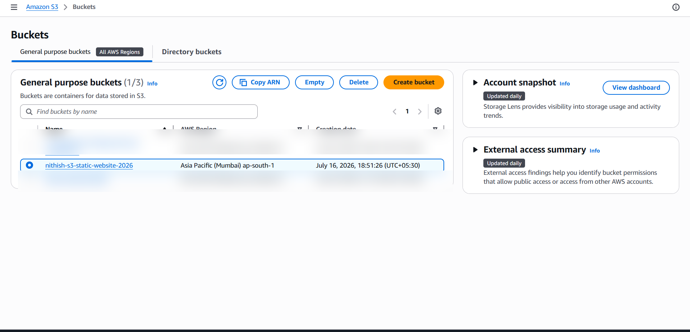
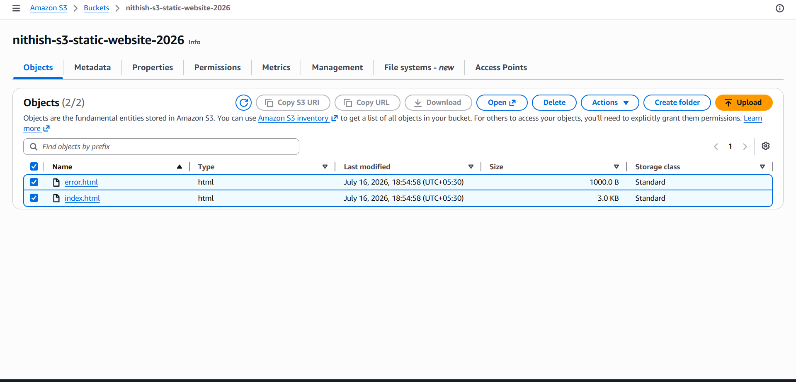
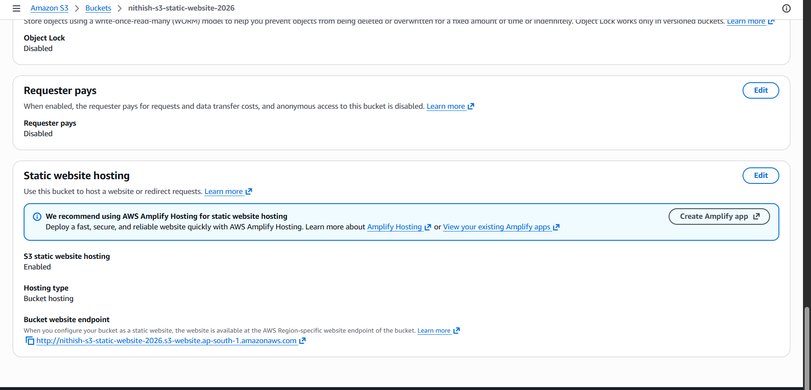
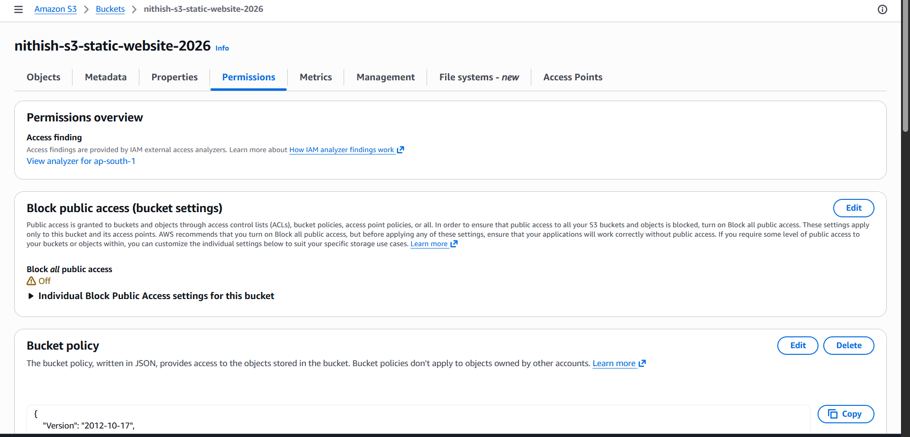
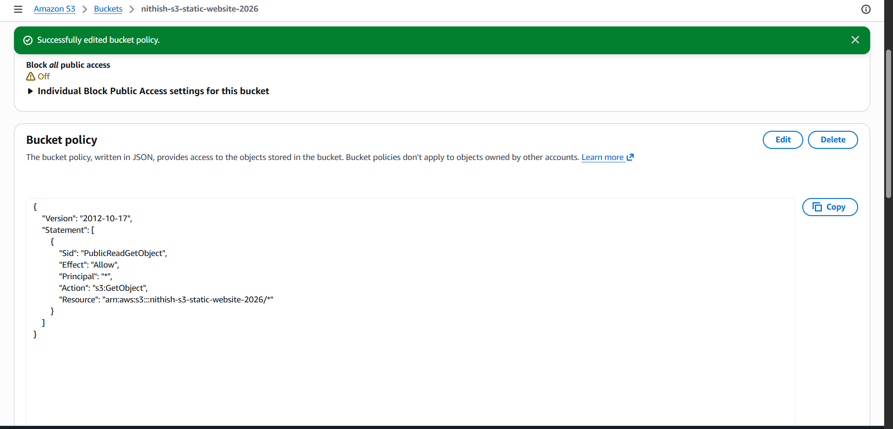
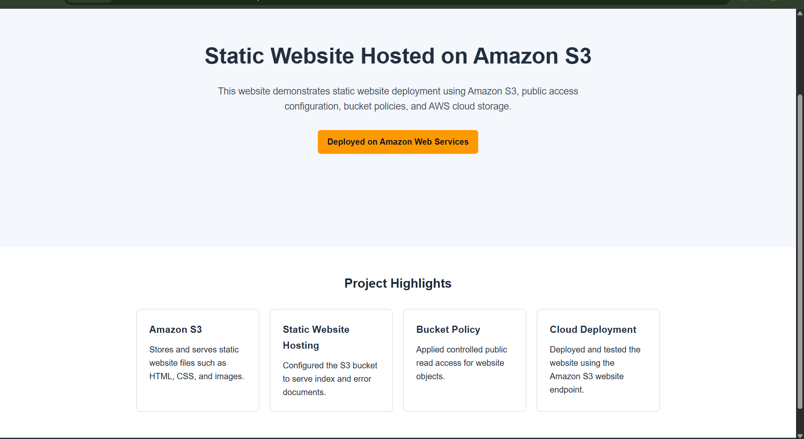
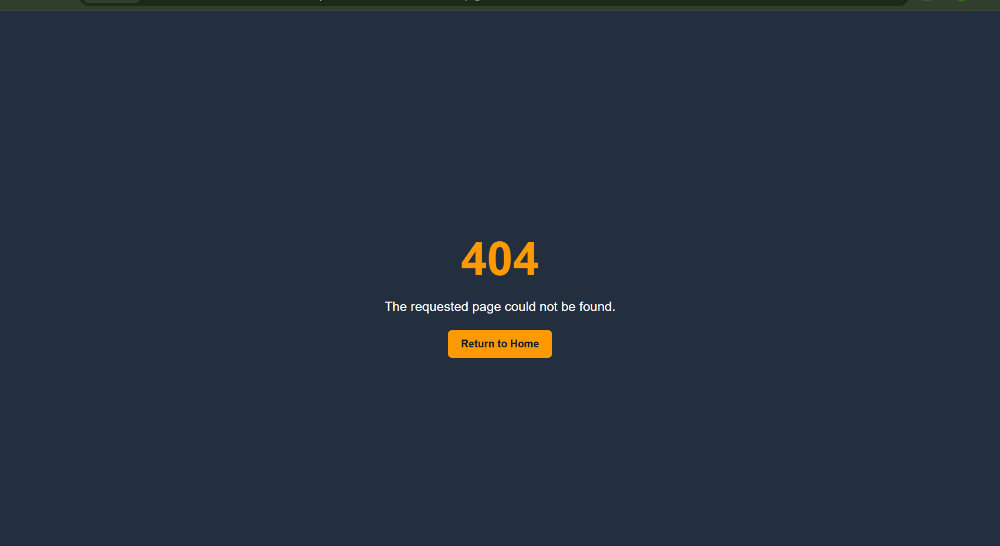

# Static Website Hosting on Amazon S3

[](https://aws.amazon.com/s3/)
[]()
[](LICENSE)

## Project Overview

This project demonstrates the deployment of a static website using Amazon S3 Static Website Hosting.

The implementation includes bucket creation, website file upload, static website configuration, controlled public access through a bucket policy, custom error-page handling, and endpoint validation.

## Problem Statement

A static website needs a simple, scalable, and low-maintenance hosting solution without managing servers.

Amazon S3 provides object storage and built-in static website hosting, allowing HTML, CSS, JavaScript, and image files to be served directly through an AWS Region-specific website endpoint.

## Architecture

```text
User Browser
     |
     v
Amazon S3 Website Endpoint
     |
     v
S3 Bucket
├── index.html
└── error.html
```

## AWS Services Used

| Service | Purpose |
|---|---|
| Amazon S3 | Stores and serves the static website files |
| S3 Static Website Hosting | Configures the bucket as a website |
| S3 Bucket Policy | Grants public read access to website objects |

## Repository Structure

```text
aws-s3-static-website-hosting/
├── docs/
│   └── deployment-guide.md
├── screenshots/
│   ├── bucket-overview.png
│   ├── files-uploaded.png
│   ├── static-hosting-enabled.png
│   ├── public-access-configured.png
│   ├── bucket-policy-configured.png
│   ├── website-output.png
│   └── custom-error-page.png
├── website/
│   ├── index.html
│   └── error.html
├── LICENSE
└── README.md
```

## Implementation Summary

1. Created a general-purpose S3 bucket in the Asia Pacific (Mumbai) Region.
2. Uploaded `index.html` and `error.html` to the bucket root.
3. Enabled S3 Static Website Hosting.
4. Configured `index.html` as the index document.
5. Configured `error.html` as the custom error document.
6. Disabled bucket-level Block Public Access for this learning project.
7. Applied a bucket policy granting public `s3:GetObject` access.
8. Tested the website endpoint and custom 404 page.

## Bucket Policy

```json
{
  "Version": "2012-10-17",
  "Statement": [
    {
      "Sid": "PublicReadGetObject",
      "Effect": "Allow",
      "Principal": "*",
      "Action": "s3:GetObject",
      "Resource": "arn:aws:s3:::nithish-s3-static-website-2026/*"
    }
  ]
}
```

## Deployment Evidence

### Bucket Overview



### Uploaded Website Files



### Static Website Hosting Configuration



### Public Access Configuration



### Bucket Policy



### Website Output



### Custom Error Page



## Security Considerations

- No AWS access keys, secret keys, passwords, or MFA codes are stored in this repository.
- Public access is limited to object-read operations using `s3:GetObject`.
- Only static website files are stored in the public bucket.
- Bucket ACLs remain disabled.
- The S3 website endpoint uses HTTP and does not provide native HTTPS support.

For a production deployment, Amazon CloudFront should be added to provide HTTPS, caching, improved performance, and more secure origin access.

## Key Learnings

- Creating and configuring an Amazon S3 bucket
- Uploading and managing S3 objects
- Enabling S3 Static Website Hosting
- Configuring index and custom error documents
- Managing Block Public Access settings
- Writing and applying an S3 bucket policy
- Testing website and error-page endpoints
- Documenting AWS deployment evidence professionally

## Limitations

- The direct S3 website endpoint supports HTTP only.
- The website does not currently use a custom domain.
- Amazon CloudFront is not included in this version.
- The bucket is publicly readable for demonstration purposes.

## Future Improvements

- Add Amazon CloudFront for HTTPS and content delivery
- Configure a custom domain using Amazon Route 53
- Add an ACM SSL/TLS certificate
- Automate deployment using AWS CLI or GitHub Actions
- Recreate the infrastructure using AWS CloudFormation

## Cleanup

To remove the AWS resources:

1. Delete all objects from the S3 bucket.
2. Disable Static Website Hosting if required.
3. Delete the S3 bucket.
4. Verify that no related resources remain.

## Author

**Nithishkumar K**

Aspiring Cloud & DevOps Engineer

[LinkedIn](https://www.linkedin.com/in/nithishkumar-k-072726388)  
[GitHub](https://github.com/NITHISHKUMAR-IT)
